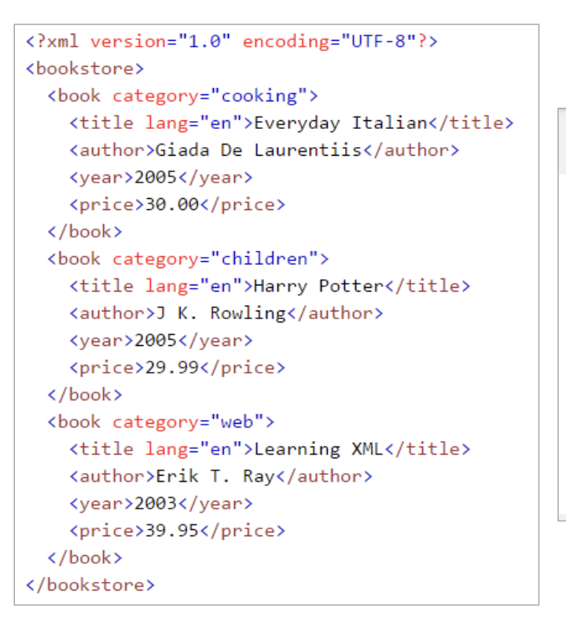
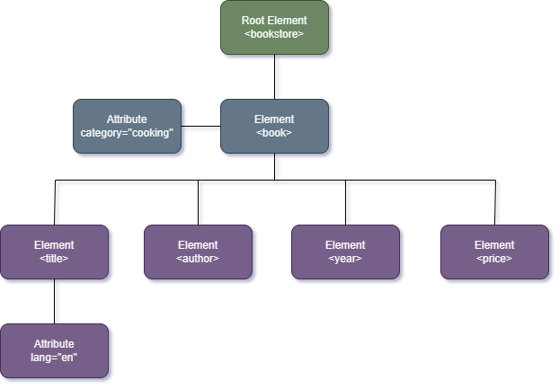

# 📃 Documentos bien formados

Todas los puntos que debe cumplir un documento bien formado son:

1. Solo caracteres Unicode válidos
✔️ Bien
```xml
<mensaje>Hola, qué tal?</mensaje>
```
❌ Mal (caracter inválido oculto)
```xml
<mensaje>Hola, que tal??</mensaje>
```
2. Hay un solo elemento raíz
✔️ Bien
```xml
<cine>
    <sala>...</sala>
</cine>
```
❌ Mal
```xml
<sala>...</sala>
<peli>...</peli>
```
3. Nombres de etiquetas/atributos SIN espacios (usar **snake_case** o **camelCase**)
✔️ Bien
```xml
<nombre_cliente>Patri</nombre_cliente>
<edadCliente>87</edadCliente>
```
❌ Mal
```xml
<nombre cliente>Patri</nombre cliente>
```
4. Las etiquetas/atributos empiezan por letras, NO por números ni otras webadas
✔️ Bien
```xml
<producto1 precio="20">Camisa</producto1>
```
❌ Mal
```xml
<2producto precio="30">Zapatos</2producto>
```
5. El resto de caracteres pueden ser letras, numeros, guiones, etc.
✔️ Bien
```xml
<nombre-especial>Paco</nombre-especial>
```
❌ Mal
```xml
<nombre@especial>Paco</nombre@especial>
```
6. Sustituir `"`, `'`, `<`, `>` y `&` por entidades
✔️ Bien
```xml
<comentario>5 &lt; 10 y 10 &gt; 5</comentario>
```
❌ Mal
```xml
<comentario>5 < 10 y 10 > 5</comentario>
```
7. Etiquetas bien anidadas y tabuladas!
✔️ Bien
```xml
<a>
    <b>Texto</b>
    <c>Text</c>
</a>
```
❌ Mal
```xml
<a>
    <b>Texto
    </a>
```
8. Las aperturas y cierres coinciden exaccctamente
✔️ Bien
```xml
<Libro id="1">Quijote</Libro>
```
❌ Mal
```xml
<libro id="1">Quijote</Libro>
```
9.  El cierre nunca lleva atributos
✔️ Bien
```xml
<persona id="2">Paca</persona>
```
❌ Mal
```xml
<persona id="2">Paca</persona id="2">
```
10. No puede haber 2 atributos iguales en la misma etiqueta
✔️ Bien
```xml
<user id="1" rol="admin">Mario</user>
```
❌ Mal
```xml
<user id="1" id="2">Mario</user>
```
11. Los atributos deben tener valor
✔️ Bien
```xml
<libro titulo="Dune">...</libro>
```
❌ Mal
```xml
<libro titulo="">...</libro>
```
12. Todos los valores de atributos van entre comillas!
✔️ Bien
```xml
<oroducto nombre="Camiseta" precio="19.90">...</producto>
```
❌ Mal
```xml
<producto nombre=Camiseta precio=19.90>...</producto>
```
13. No usar referencias dentro de valores de atributos
✔️ Bien
```xml
<imagen src="foto.png"/>
```
❌ Mal
```xml
<imagen src="foto.png?dato=&amp;id"/>
```

---

# 🌳 XML Tree Stricture

Sirve para una mejor legibilidad.

Ejemplo de código:

<p align="center">
  
</p>

Ejemplo del código anterior pasado a **Tree Structure**:

<p align="center">
  
</p>

---

> ESto es todo lo que hemos visto hoy :D
> Próxima clase: DTD 🫦 y XML Schema 🥵🪭 (_ficheros que acompañan al XML para darle una estructura_) 